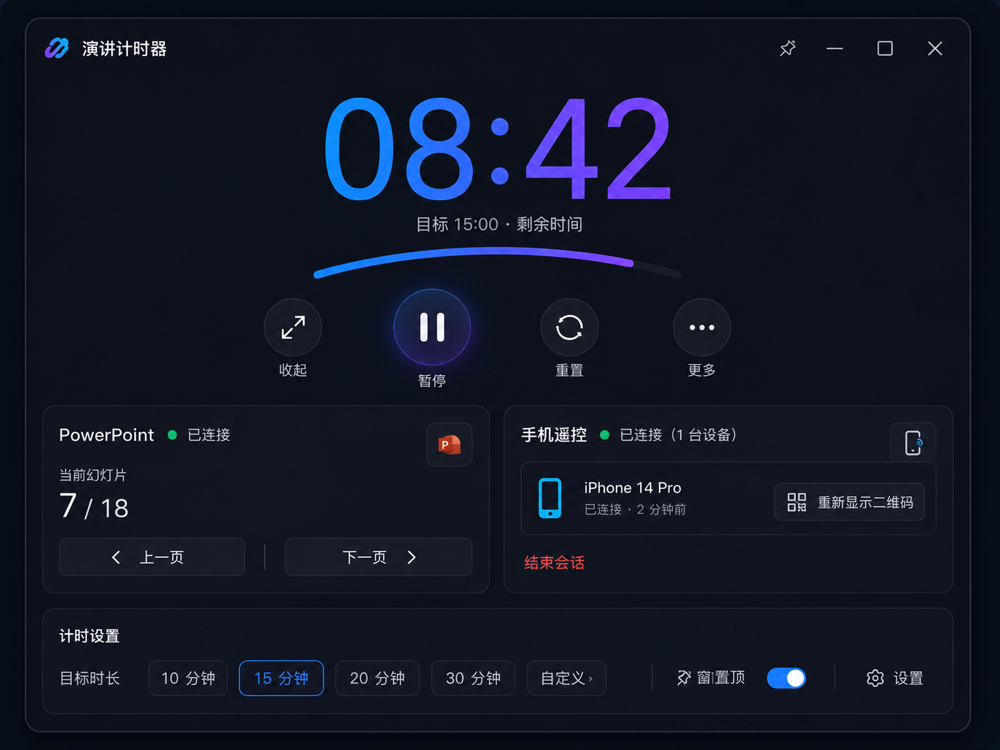
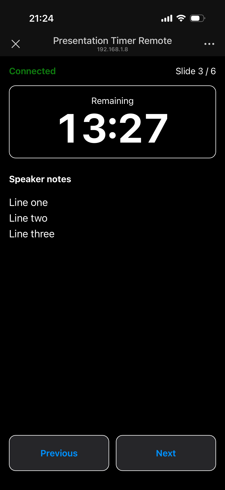

<div align="center">

**中文** · [English](./README.md)

# PresentationTimer

**一个本地优先的 Windows 演讲者工作台：计时、PowerPoint 控制、演讲者备注和手机遥控，一处完成。**


[](https://github.com/hongjiapeng/PresentationTimer/releases)

</div>

PresentationTimer 把现场演讲所需的核心工具放在同一个界面中：精准的倒计时/超时计时器、PowerPoint 翻页和演讲者备注监测，以及供同一可信局域网内手机使用的浏览器遥控器。

它在本地运行，不需要账户；退出应用时也不会关闭演示文稿或 PowerPoint。

## 产品预览

| 桌面工作台 · 设计参考 | 手机遥控 · 实际界面 |
|:---:|:---:|
|  |  |
| 在一个工作台中查看计时器、PowerPoint 状态、翻页控制、远程配对和时长设置。 | 在手机浏览器中查看剩余时间、当前幻灯片和备注，并进行上一页/下一页操作。 |

| 紧凑计时器 | 演讲者 HUD |
|:---:|:---:|
|  |  |
| 保留进度和核心控制的专注计时界面。 | 演讲时保持可见的极简计时浮层。 |

## 功能概览

| 模块 | 功能 |
|---|---|
| **计时器** | 倒计时、暂停/继续、重置、进度、警告状态和超时显示 |
| **PowerPoint** | 打开或连接桌面演示文稿，跟踪幻灯片位置与备注，并控制上一页/下一页 |
| **手机遥控** | 扫描二维码配对，通过同一可信 Wi-Fi/LAN 中的浏览器控制幻灯片 |
| **本地优先** | 不需要账户或云服务；会话凭据只保存在内存中，并在会话结束时撤销 |
| **演讲模式** | 展开工作台、紧凑计时器和演讲者 HUD |

## 快速开始

1. 从 [GitHub Releases](https://github.com/hongjiapeng/PresentationTimer/releases) 下载 Windows 安装程序或便携 ZIP。
2. 打开 PresentationTimer，选择或输入 `15:00` 这样的时长。
3. 打开 `.ppt`、`.pptx`、`.pptm`、`.pps` 或 `.ppsx` 文件；也可以先在 PowerPoint 中开始放映，让 PresentationTimer 自动连接。
4. 启动计时器。暂停、继续和重置仍然是桌面端本地命令。
5. 选择 **Start remote**，再用同一可信网络中的手机扫描二维码。
6. 演讲结束后选择 **End session**，使本次会话的二维码令牌和所有浏览器 Cookie 失效。

> [!IMPORTANT]
> 手机遥控在局域网中使用经过鉴权的 HTTP，而不是 HTTPS。请只在可信私有 Wi-Fi/LAN 中使用。详见[安全与隐私](#安全与隐私)。

## 运行要求

| 要求 | 说明 |
|---|---|
| Windows | Windows 10 22H2 或 Windows 11（x64） |
| PowerPoint | 演示文稿集成功能需要 Microsoft PowerPoint 桌面版 |
| 开发环境 | .NET 10 SDK、安装了 WinUI 应用开发工作负载的 Visual Studio 2026，以及用于未打包 Debug 启动的开发者模式 |

PowerPoint 集成功能要求系统已注册 `PowerPoint.Application` COM 类。当前适配器不支持 WPS Office、网页版 PowerPoint 或 Microsoft 365/Office 门户应用。

## 安全与隐私

远程会话使用 256 位一次性配对令牌，并将其交换为独立的 `HttpOnly`、`SameSite=Strict` 浏览器 Cookie。凭据只保存在内存中，并在会话结束时撤销。

这可以避免未经授权的误操作，但 HTTP 无法防御能够监听或篡改恶意/公共 Wi-Fi 流量的攻击者。请使用可信的私有网络，并在演讲结束后结束会话。

结构化 Serilog 事件写入 `%LOCALAPPDATA%\PresentationTimer\Logs`。日志按天及 5 MiB 滚动，最多保留七个文件七天，并刻意排除演讲者备注、配对令牌、浏览器 Cookie 和完整的含令牌配对 URL。

## 故障排除

<details>
<summary><strong>未检测到 PowerPoint 桌面版</strong></summary>

请安装或修复 Microsoft PowerPoint 桌面版，先启动一次以完成登录或激活，再重启 PresentationTimer。仅选择演示文稿文件不能绕过 COM 要求。

引导式检查脚本可以打开微软官方安装页面并重新检查 COM 注册：

```powershell
.\scripts\Ensure-PowerPointDesktop.ps1 -OpenInstaller -WaitAfterOpening
```

如果系统提供 `winget`，可以安装 Microsoft 365 Apps for enterprise：

```powershell
winget install --id Microsoft.Office `
  --source winget `
  --accept-source-agreements `
  --accept-package-agreements
```

这会安装完整的 Microsoft 365 桌面套件。脚本不会绕过登录、许可证、用户账户控制或 Office 激活。

</details>

<details>
<summary><strong>无法打开所选 PowerPoint 文件</strong></summary>

- 确认已安装并激活 Microsoft PowerPoint 桌面版。
- 启动 PowerPoint 一次，完成所有修复或激活提示。
- 使用受支持的 `.ppt`、`.pptx`、`.pptm`、`.pps` 或 `.ppsx` 文件。
- WPS 支持需要单独的适配器，目前尚未启用。

不支持、缺失或不可读的文件会安全报错，不会改变当前演示状态。

</details>

<details>
<summary><strong>手机无法连接</strong></summary>

- 确认电脑和手机位于同一个 Wi-Fi/LAN，并且可以直接互相访问。
- 暂时禁用 VPN，并检查接入点是否启用了客户端/AP 隔离。
- 如果 Windows 防火墙弹出提示，请允许 PresentationTimer 使用**专用网络**。应用不会自行提升权限或修改防火墙设置。
- 如果电脑更换了网络或 IP 地址，请选择新的可访问适配器 URL，并扫描替代二维码。
- 企业策略可能禁止局域网入站监听；请联系管理员允许此应用访问本地子网。

</details>

## 开发

### 构建与测试

```powershell
dotnet restore PresentationTimer.sln
dotnet build PresentationTimer.sln -c Debug -p:Platform=x64
dotnet test PresentationTimer.sln -c Debug -p:Platform=x64
```

完成 Debug x64 构建后运行桌面 UI 冒烟检查：

```powershell
.\scripts\ui-smoke.ps1 -AppPath .\src\PresentationTimer.App\bin\x64\Debug\net10.0-windows10.0.26100.0\win-x64\PresentationTimer.App.exe
```

### 便携发布

创建关闭裁剪、未打包且自包含的 x64 输出：

```powershell
dotnet publish .\src\PresentationTimer.App\PresentationTimer.App.csproj -c Release -p:Platform=x64 -r win-x64 -o .\artifacts\publish\win-x64
```

从发布目录直接启动 `PresentationTimer.App.exe`。移除便携版本只需关闭应用并删除该目录；除非单独删除，否则本地诊断日志仍保留在 `%LOCALAPPDATA%\PresentationTimer\Logs`。

### Windows 安装程序与发布

Inno Setup 安装程序按用户安装到 `%LOCALAPPDATA%\Programs\PresentationTimer`，不需要管理员权限，支持英文、简体中文和繁体中文，并可选创建桌面快捷方式或在登录时启动应用。

安装 Inno Setup 6 后，可在本地构建：

```powershell
.\scripts\build-installer.ps1 -Version 0.1.0
```

提交并推送预期变更后，发布版本：

```powershell
.\scripts\release.ps1 0.1.0
```

发布脚本会运行测试套件并推送带注释的 `v*` 标签。随后 GitHub Actions 构建安装程序和便携 ZIP，并创建或更新 GitHub Release。

## PowerPoint 测试夹具

[`tests/fixtures/PresentationTimer.PowerPointFixture.pptx`](tests/fixtures/PresentationTimer.PowerPointFixture.pptx) 是一个原创、以程序生成的 6 页演示文稿，用于人工验证。它覆盖空备注、多行备注、必须保持为纯文本的类 HTML 文本、真正隐藏的幻灯片，以及末页边界行为。

这个 PPT 不包含外部图片、图表、事实性声明或第三方素材。它的定位是测试夹具和人工验证 sample，而不是产品宣传演示文稿。详见[人工验证指南](docs/manual-verification.md)和 [PowerPoint 检查清单](docs/powerpoint-manual-checklist.md)。

## 第三方声明

第三方组件和声明见 [THIRD-PARTY-NOTICES.md](THIRD-PARTY-NOTICES.md)。

---

<div align="center">

为专注的 Windows 演讲体验而构建。

</div>
